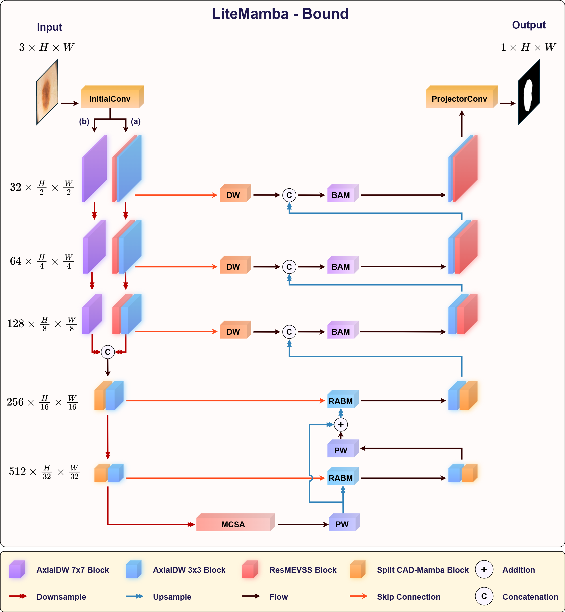

#  LiteMamba-Bound: A lightweight Mamba-based model with boundary-aware and normalized active contour loss for skin lesion segmentation [**[Paper Link]**](https://www.sciencedirect.com/science/article/pii/S1046202325000118)
In the field of medical science, skin segmentation has gained significant importance, particularly in dermatology and skin cancer research. This domain demands high precision in distinguishing critical regions (such as lesions 
or moles) from healthy skin in medical images. With growing technological advancements, deep learning 
models have emerged as indispensable tools in addressing these challenges. One of the state-of-the-art modules 
revealed in recent years, the 2D Selective Scan (SS2D), based on state-space models that have already seen great 
success in natural language processing, has been increasingly adopted and is gradually replacing Convolutional 
Neural Networks (CNNs) and Vision Transformers (ViTs). Leveraging the strength of this module, this paper 
introduces LiteMamba-Bound, a lightweight model with approximately 957K parameters, designed for skin image 
segmentation tasks. Notably, the Channel Attention Dual Mamba (CAD-Mamba) block is proposed within both 
the encoder and decoder alongside the Mix Convolution with Simple Attention bottleneck block to emphasize key 
features. Additionally, we propose the Reverse Attention Boundary Module to highlight challenging boundary 
features. Also, the Normalized Active Contour loss function presented in this paper significantly improves the 
model’s performance compared to other loss functions. To validate performance, we conducted tests on two skin 
image datasets, ISIC2018 and PH2, with results consistently showing superior performance compared to other 
models. 
# Network

# Evaluation


# Main Environments
- Google Colab with NVidia T4 GPU
- PyTorch v2.4.0
- Torchvision v0.19.0

# Citation 
If you find this reference implementation useful in your research, please consider citing:

```bibtex
@article{ho2025litemamba,
  title={LiteMamba-Bound: A Lightweight Mamba-based Model with Boundary-Aware and Normalized Active Contour Loss for Skin Lesion Segmentation},
  author={Ho, Quang-Huy and Tran, Thi-Thao and Pham, Van-Truong and others},
  journal={Methods},
  year={2025},
  publisher={Elsevier}
}
